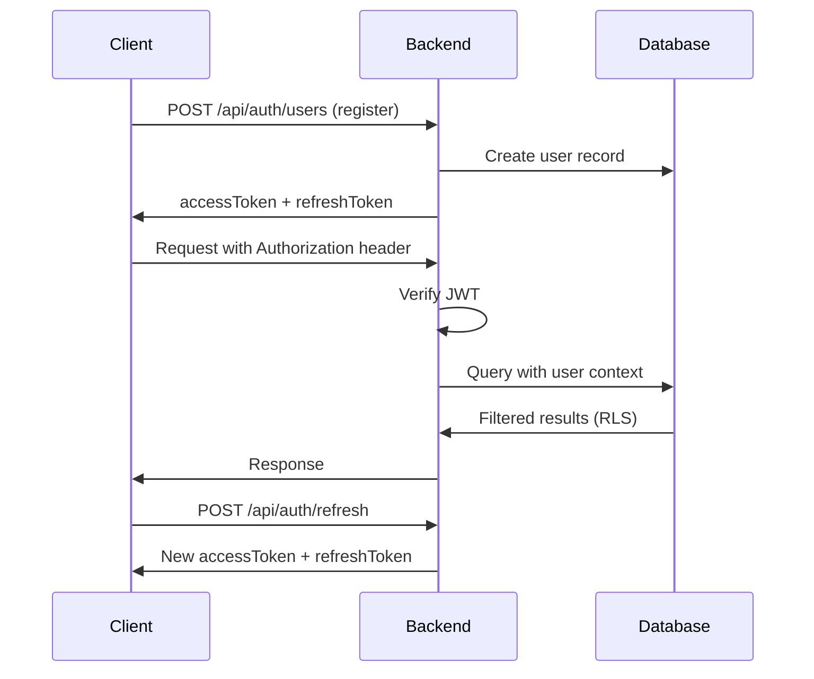

## Overview

InsForge provides a complete authentication system with JWT tokens, user management, and support for multiple OAuth providers.

### Key Features

- **Email/Password Auth** - Traditional authentication with email verification
- **OAuth Providers** - Google, GitHub, Discord, LinkedIn, and more
- **JWT Tokens** - Secure, stateless authentication
- **Refresh Tokens** - Long-lived sessions with token rotation
- **PKCE Flow** - Secure OAuth for mobile and desktop apps
- **Row Level Security** - Database-level access control
- **Profile Management** - Separate user profiles with custom fields

## Authentication Flow



## Email/Password Authentication

### Registration

<CodeGroup>
```typescript TypeScript SDK
import { createClient } from '@insforge/sdk';

const client = createClient({
  baseUrl: 'https://your-app.region.insforge.app',
  anonKey: 'your-anon-key'
});

const { data, error } = await client.auth.signUp({
  email: 'user@example.com',
  password: 'securepassword123',
  name: 'John Doe'
});

if (error) {
  console.error('Registration failed:', error);
} else {
  console.log('User:', data.user);
  console.log('Access Token:', data.accessToken);
}
```

```bash cURL
curl -X POST https://your-app.region.insforge.app/api/auth/users \
  -H "Content-Type: application/json" \
  -d '{
    "email": "user@example.com",
    "password": "securepassword123",
    "name": "John Doe"
  }'
```
</CodeGroup>

<Info>
If email verification is enabled, `accessToken` will be `null` until the user verifies their email.
</Info>

### Login

<CodeGroup>
```typescript TypeScript SDK
const { data, error } = await client.auth.signIn({
  email: 'user@example.com',
  password: 'securepassword123'
});

if (error) {
  console.error('Login failed:', error);
} else {
  // Access token is automatically stored
  console.log('Logged in:', data.user);
}
```

```bash cURL
curl -X POST https://your-app.region.insforge.app/api/auth/sessions \
  -H "Content-Type: application/json" \
  -d '{
    "email": "user@example.com",
    "password": "securepassword123"
  }'
```
</CodeGroup>

Response:
```json
{
  "user": {
    "id": "550e8400-e29b-41d4-a716-446655440000",
    "email": "user@example.com",
    "profile": {
      "name": "John Doe",
      "avatar_url": null
    },
    "emailVerified": true,
    "providers": ["email"],
    "createdAt": "2024-01-15T10:30:00Z"
  },
  "accessToken": "eyJhbGciOiJIUzI1NiIsInR5cCI6IkpXVCJ9...",
  "csrfToken": "abc123..." // Web clients only
}
```

### Get Current User

<CodeGroup>
```typescript TypeScript SDK
const { data: user, error } = await client.auth.getUser();

if (error) {
  console.log('Not authenticated');
} else {
  console.log('Current user:', user);
}
```

```bash cURL
curl https://your-app.region.insforge.app/api/auth/sessions/current \
  -H "Authorization: Bearer YOUR_ACCESS_TOKEN"
```
</CodeGroup>

### Logout

<CodeGroup>
```typescript TypeScript SDK
const { error } = await client.auth.signOut();

if (!error) {
  console.log('Logged out successfully');
}
```

```bash cURL
curl -X POST https://your-app.region.insforge.app/api/auth/logout
```
</CodeGroup>

## Token Management

### Client Types

InsForge supports different client types with different token storage strategies:

| Client Type | Refresh Token Storage | CSRF Protection |
|-------------|----------------------|----------------|
| **Web** | httpOnly cookie | Required |
| **Mobile** | Response body | Not needed |
| **Desktop** | Response body | Not needed |

### Web Clients (Browser)

<Steps>
  <Step title="Register/Login">
    Refresh token is stored in httpOnly cookie automatically:
    ```typescript
    const { data } = await client.auth.signIn({
      email: 'user@example.com',
      password: 'password'
    });
    // csrfToken returned in response
    ```
  </Step>
  
  <Step title="Refresh Token">
    Use CSRF token for refresh:
    ```typescript
    const { data } = await client.auth.refreshSession();
    // New accessToken and csrfToken
    ```
  </Step>
</Steps>

### Mobile/Desktop Clients

Specify `client_type=mobile` or `client_type=desktop`:

<CodeGroup>
```typescript Register
const response = await fetch('/api/auth/users?client_type=mobile', {
  method: 'POST',
  headers: { 'Content-Type': 'application/json' },
  body: JSON.stringify({
    email: 'user@example.com',
    password: 'password'
  })
});

const { accessToken, refreshToken } = await response.json();
// Store refreshToken securely (e.g., Keychain, EncryptedSharedPreferences)
```

```typescript Refresh
const response = await fetch('/api/auth/refresh?client_type=mobile', {
  method: 'POST',
  headers: { 'Content-Type': 'application/json' },
  body: JSON.stringify({
    refreshToken: storedRefreshToken
  })
});

const { accessToken, refreshToken: newRefreshToken } = await response.json();
// Update stored refreshToken
```
</CodeGroup>

### Automatic Token Refresh

The SDK handles token refresh automatically:

```typescript
const client = createClient({
  baseUrl: 'https://your-app.region.insforge.app',
  anonKey: 'your-anon-key',
  autoRefresh: true // Default
});

// SDK automatically refreshes when token expires
const { data } = await client.database.from('posts').select();
```

## OAuth Authentication

Supported providers:
- Google
- GitHub  
- Discord
- LinkedIn
- Facebook
- Instagram
- TikTok
- Apple
- X (Twitter)
- Spotify
- Microsoft

### Web Flow (Browser)

<Steps>
  <Step title="Initiate OAuth">
    Redirect user to provider:
    ```typescript
    const { data } = await client.auth.signInWithOAuth({
      provider: 'google',
      redirectTo: 'https://yourapp.com/auth/callback'
    });
    
    window.location.href = data.authUrl;
    ```
  </Step>
  
  <Step title="Handle Callback">
    Extract tokens from callback URL:
    ```typescript
    // On your callback page
    const params = new URLSearchParams(window.location.search);
    const accessToken = params.get('access_token');
    const userId = params.get('user_id');
    const csrfToken = params.get('csrf_token');
    
    if (accessToken) {
      // Store token and redirect to app
      client.auth.setSession({ accessToken, csrfToken });
      window.location.href = '/dashboard';
    }
    ```
  </Step>
</Steps>

### PKCE Flow (Mobile/Desktop)

<Steps>
  <Step title="Generate Code Verifier">
    ```typescript
    import { randomBytes, createHash } from 'crypto';
    
    // Generate random code_verifier (43-128 chars)
    const codeVerifier = randomBytes(32).toString('base64url');
    
    // Generate code_challenge
    const codeChallenge = createHash('sha256')
      .update(codeVerifier)
      .digest('base64url');
    ```
  </Step>
  
  <Step title="Initiate OAuth with PKCE">
    ```typescript
    const response = await fetch(
      `/api/auth/oauth/google?redirect_uri=${redirectUri}&code_challenge=${codeChallenge}`
    );
    const { authUrl } = await response.json();
    
    // Open authUrl in browser or webview
    ```
  </Step>
  
  <Step title="Handle Callback">
    ```typescript
    // Extract insforge_code from callback URL
    const code = new URLSearchParams(callbackUrl).get('insforge_code');
    ```
  </Step>
  
  <Step title="Exchange Code for Tokens">
    ```typescript
    const response = await fetch('/api/auth/oauth/exchange', {
      method: 'POST',
      headers: { 'Content-Type': 'application/json' },
      body: JSON.stringify({
        code: code,
        code_verifier: codeVerifier
      })
    });
    
    const { accessToken, refreshToken, user } = await response.json();
    // Store tokens securely
    ```
  </Step>
</Steps>

### Shared OAuth Keys

InsForge Cloud provides shared OAuth keys for quick setup:

```typescript
// Automatically uses shared keys if configured
const { data } = await client.auth.signInWithOAuth({
  provider: 'google',
  useSharedKey: true
});
```

## Email Verification

### Configuration

Two verification methods:
- **Code** - 6-digit OTP sent via email
- **Link** - Magic link with token

### Code Verification

<Steps>
  <Step title="Request Code">
    ```typescript
    const { error } = await client.auth.sendVerificationCode({
      email: 'user@example.com'
    });
    ```
  </Step>
  
  <Step title="Verify Code">
    ```typescript
    const { data, error } = await client.auth.verifyEmail({
      email: 'user@example.com',
      otp: '123456'
    });
    
    if (!error) {
      console.log('Email verified:', data.user);
      console.log('Access token:', data.accessToken);
    }
    ```
  </Step>
</Steps>

### Link Verification

<Steps>
  <Step title="Send Link">
    ```typescript
    const { error } = await client.auth.sendVerificationLink({
      email: 'user@example.com'
    });
    ```
  </Step>
  
  <Step title="User Clicks Link">
    The backend endpoint handles verification:
    ```
    GET /api/auth/email/verify?otp={64-char-token}
    ```
    Redirects to `verifyEmailRedirectTo` URL if configured.
  </Step>
</Steps>

## Password Reset

### Code Method (Two-Step)

<Steps>
  <Step title="Request Reset Code">
    ```typescript
    const { error } = await client.auth.sendPasswordResetCode({
      email: 'user@example.com'
    });
    ```
  </Step>
  
  <Step title="Exchange Code for Token">
    ```typescript
    const { data, error } = await client.auth.exchangeResetCode({
      email: 'user@example.com',
      code: '123456'
    });
    
    const resetToken = data.token;
    ```
  </Step>
  
  <Step title="Reset Password">
    ```typescript
    const { error } = await client.auth.resetPassword({
      otp: resetToken,
      newPassword: 'newSecurePassword123'
    });
    ```
  </Step>
</Steps>

### Link Method (Direct)

<Steps>
  <Step title="Request Reset Link">
    ```typescript
    const { error } = await client.auth.sendPasswordResetLink({
      email: 'user@example.com'
    });
    ```
  </Step>
  
  <Step title="User Clicks Link">
    Link contains token:
    ```
    https://yourapp.com/reset-password?token={64-char-token}
    ```
  </Step>
  
  <Step title="Reset Password">
    ```typescript
    const { error } = await client.auth.resetPassword({
      otp: tokenFromUrl,
      newPassword: 'newSecurePassword123'
    });
    ```
  </Step>
</Steps>

## Profile Management

### Update Current User's Profile

<CodeGroup>
```typescript TypeScript SDK
const { data, error } = await client.auth.updateProfile({
  name: 'Jane Doe',
  avatar_url: 'https://example.com/avatar.jpg',
  // Custom fields
  bio: 'Software developer',
  location: 'San Francisco'
});
```

```bash cURL
curl -X PATCH https://your-app.region.insforge.app/api/auth/profiles/current \
  -H "Authorization: Bearer YOUR_ACCESS_TOKEN" \
  -H "Content-Type: application/json" \
  -d '{
    "profile": {
      "name": "Jane Doe",
      "avatar_url": "https://example.com/avatar.jpg",
      "bio": "Software developer"
    }
  }'
```
</CodeGroup>

### Get User Profile by ID

<CodeGroup>
```typescript TypeScript SDK
const { data, error } = await client.auth.getProfile(userId);

if (!error) {
  console.log('Profile:', data.profile);
}
```

```bash cURL
curl https://your-app.region.insforge.app/api/auth/profiles/{userId}
```
</CodeGroup>

## Password Requirements

Configure password rules via admin API:

```json
{
  "passwordMinLength": 8,
  "requireNumber": true,
  "requireLowercase": true,
  "requireUppercase": true,
  "requireSpecialChar": false
}
```

Get public config:
```typescript
const { data } = await client.auth.getPublicConfig();
console.log('Password requirements:', data);
```

## JWT Token Structure

```json
{
  "sub": "550e8400-e29b-41d4-a716-446655440000",
  "email": "user@example.com",
  "role": "authenticated",
  "iat": 1705320600,
  "exp": 1705324200
}
```

- `sub` - User ID
- `role` - `authenticated` or `project_admin`
- `exp` - Token expires after 1 hour

## API Reference

### Endpoints

```
POST   /api/auth/users                    # Register
POST   /api/auth/sessions                 # Login
POST   /api/auth/refresh                  # Refresh token
POST   /api/auth/logout                   # Logout
GET    /api/auth/sessions/current         # Get current user
PATCH  /api/auth/profiles/current         # Update profile
GET    /api/auth/profiles/{userId}        # Get profile
GET    /api/auth/public-config            # Get auth config

# Email verification
POST   /api/auth/email/send-verification
POST   /api/auth/email/verify

# Password reset
POST   /api/auth/email/send-reset-password
POST   /api/auth/email/exchange-reset-password-token
POST   /api/auth/email/reset-password

# OAuth
GET    /api/auth/oauth/{provider}
POST   /api/auth/oauth/exchange
GET    /api/auth/oauth/{provider}/callback
POST   /api/auth/oauth/{provider}/callback
```

## Best Practices

<Card title="Use Refresh Tokens" icon="rotate">
  Implement token refresh to maintain long-lived sessions
</Card>

<Card title="Secure Token Storage" icon="vault">
  - Web: Let SDK handle httpOnly cookies
  - Mobile: Use Keychain (iOS) or EncryptedSharedPreferences (Android)
</Card>

<Card title="Enable Email Verification" icon="envelope-circle-check">
  Reduce fake accounts and improve security
</Card>

<Card title="Use PKCE for Native Apps" icon="mobile">
  Prevents authorization code interception attacks
</Card>

<Card title="Implement RLS Policies" icon="shield-halved">
  Protect user data at the database level
</Card>

## Next Steps

<CardGroup cols={2}>
  <Card title="Database" icon="database" href="/features/database">
    Protect data with Row Level Security
  </Card>
  <Card title="Storage" icon="folder" href="/features/storage">
    Upload user files securely
  </Card>
  <Card title="Real-time" icon="radio" href="/features/realtime">
    Build live collaborative features
  </Card>
  <Card title="Functions" icon="code" href="/features/functions">
    Add custom authentication logic
  </Card>
</CardGroup>
