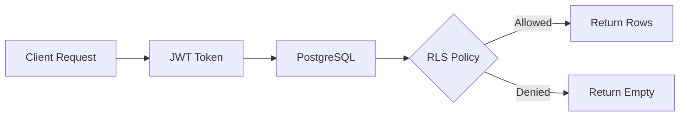

## Overview

InsForge provides a PostgreSQL database with automatic REST API generation using PostgREST-style endpoints. Every table you create instantly gets CRUD endpoints with filtering, sorting, and pagination.

### Key Features

- **Instant REST APIs** - Auto-generated endpoints for all tables
- **PostgREST-style Queries** - Powerful filtering with `eq`, `gt`, `lt`, `like`, etc.
- **Row Level Security** - Fine-grained access control at the database level
- **pgvector Support** - Built-in vector embeddings for AI applications
- **Relationships** - Foreign keys and automatic joins
- **Real-time Subscriptions** - Listen to database changes via WebSockets

## Table Management

### Creating Tables

Create tables via the API with automatic `id`, `createdAt`, and `updatedAt` fields:

<CodeGroup>
```bash cURL
curl -X POST https://your-app.region.insforge.app/api/database/tables \
  -H "Authorization: Bearer YOUR_ACCESS_TOKEN" \
  -H "Content-Type: application/json" \
  -d '{
    "tableName": "posts",
    "columns": [
      {
        "name": "title",
        "type": "string",
        "nullable": false
      },
      {
        "name": "content",
        "type": "string",
        "nullable": true
      },
      {
        "name": "published",
        "type": "boolean",
        "nullable": false,
        "defaultValue": "false"
      },
      {
        "name": "userId",
        "type": "uuid",
        "nullable": false,
        "foreignKey": {
          "table": "auth.users",
          "column": "id",
          "onDelete": "CASCADE"
        }
      }
    ],
    "rlsEnabled": true
  }'
```

```typescript TypeScript SDK
import { createClient } from '@insforge/sdk';

const client = createClient({
  baseUrl: 'https://your-app.region.insforge.app',
  anonKey: 'your-anon-key'
});

// Note: Table creation is typically done via admin API
// Use MCP tools or direct API calls for schema management
```
</CodeGroup>

### Supported Column Types

| Type | PostgreSQL | Description |
|------|-----------|-------------|
| `string` | TEXT | Variable-length text |
| `integer` | INTEGER | Whole numbers |
| `float` | DOUBLE PRECISION | Decimal numbers |
| `boolean` | BOOLEAN | True/false values |
| `datetime` | TIMESTAMP WITH TIME ZONE | Date and time |
| `uuid` | UUID | Universally unique identifier |
| `json` | JSONB | JSON data |
| `file` | TEXT | File URLs from storage |

### Getting Table Schema

```bash
curl https://your-app.region.insforge.app/api/database/tables/posts/schema \
  -H "Authorization: Bearer YOUR_ACCESS_TOKEN"
```

Response:
```json
{
  "tableName": "posts",
  "columns": [
    {
      "name": "id",
      "type": "uuid",
      "nullable": false,
      "unique": true,
      "default": "gen_random_uuid()",
      "isPrimaryKey": true,
      "foreignKey": null
    },
    {
      "name": "title",
      "type": "string",
      "nullable": false,
      "unique": false,
      "default": null,
      "isPrimaryKey": false,
      "foreignKey": null
    },
    {
      "name": "createdAt",
      "type": "datetime",
      "nullable": false,
      "unique": false,
      "default": "now()",
      "isPrimaryKey": false,
      "foreignKey": null
    }
  ]
}
```

## CRUD Operations

All CRUD operations use the TypeScript SDK with the `{data, error}` response structure.

### Query Records (SELECT)

<CodeGroup>
```typescript Basic Query
const { data, error } = await client.database
  .from('posts')
  .select();

if (error) {
  console.error('Error:', error);
} else {
  console.log('Posts:', data);
}
```

```typescript Select Specific Columns
const { data, error } = await client.database
  .from('posts')
  .select('id,title,createdAt');
```

```typescript Filtering
// Equal
const { data, error } = await client.database
  .from('posts')
  .select()
  .eq('published', true);

// Greater than
const recent = await client.database
  .from('posts')
  .select()
  .gt('createdAt', '2024-01-01');

// Like (pattern matching)
const search = await client.database
  .from('posts')
  .select()
  .like('title', '%Tutorial%');
```

```typescript Sorting & Pagination
const { data, error } = await client.database
  .from('posts')
  .select()
  .order('createdAt', { ascending: false })
  .limit(10)
  .offset(20);
```
</CodeGroup>

### Filter Operators

| Operator | Method | Example |
|----------|--------|----------|
| Equal | `.eq('field', value)` | `status=eq.active` |
| Not equal | `.neq('field', value)` | `status=neq.draft` |
| Greater than | `.gt('field', value)` | `age=gt.18` |
| Greater or equal | `.gte('field', value)` | `score=gte.50` |
| Less than | `.lt('field', value)` | `price=lt.100` |
| Less or equal | `.lte('field', value)` | `quantity=lte.10` |
| Pattern match | `.like('field', pattern)` | `name=like.*John*` |
| In array | `.in('field', [values])` | `status=in.(active,pending)` |
| Is null | `.is('field', null)` | `deletedAt=is.null` |

### Create Records (INSERT)

<Info>
Insert requests **must be an array**, even for single records.
</Info>

<CodeGroup>
```typescript Single Record
const { data, error } = await client.database
  .from('posts')
  .insert([
    {
      title: 'My First Post',
      content: 'Hello world!',
      published: true
    }
  ]);
```

```typescript Multiple Records
const { data, error } = await client.database
  .from('posts')
  .insert([
    { title: 'Post 1', content: 'Content 1', published: true },
    { title: 'Post 2', content: 'Content 2', published: false },
    { title: 'Post 3', content: 'Content 3', published: true }
  ]);
```

```typescript Get Created Records
// Use .select() to return created records
const { data, error } = await client.database
  .from('posts')
  .insert([{ title: 'New Post', content: 'Content' }])
  .select();

console.log('Created:', data); // Returns the new record with id
```
</CodeGroup>

### Update Records (UPDATE)

<CodeGroup>
```typescript Update by ID
const { data, error } = await client.database
  .from('posts')
  .update({ published: true })
  .eq('id', '123e4567-e89b-12d3-a456-426614174000')
  .select();
```

```typescript Update Multiple
const { data, error } = await client.database
  .from('posts')
  .update({ published: true })
  .eq('userId', currentUserId)
  .select();
```

```typescript Partial Update
// Only updates specified fields
const { data, error } = await client.database
  .from('posts')
  .update({ title: 'Updated Title' })
  .eq('id', postId)
  .select();
```
</CodeGroup>

### Delete Records (DELETE)

<CodeGroup>
```typescript Delete by ID
const { data, error } = await client.database
  .from('posts')
  .delete()
  .eq('id', '123e4567-e89b-12d3-a456-426614174000');
```

```typescript Delete with Filter
const { data, error } = await client.database
  .from('posts')
  .delete()
  .eq('published', false)
  .lt('createdAt', '2023-01-01');
```

```typescript Get Deleted Records
const { data, error } = await client.database
  .from('posts')
  .delete()
  .eq('id', postId)
  .select(); // Returns deleted records
```
</CodeGroup>

## Response Headers

Query endpoints return useful headers:

- `X-Total-Count` - Total number of matching records
- `Content-Range` - Range of records returned (e.g., "0-99/1234")

```typescript
const response = await fetch('/api/database/records/posts?limit=10', {
  headers: { 'Authorization': `Bearer ${token}` }
});

const totalCount = response.headers.get('X-Total-Count');
const contentRange = response.headers.get('Content-Range');
```

## pgvector for Embeddings

InsForge includes pgvector for storing and querying vector embeddings.

### Creating a Table with Embeddings

```sql
CREATE TABLE documents (
  id UUID PRIMARY KEY DEFAULT gen_random_uuid(),
  content TEXT NOT NULL,
  embedding vector(1536),  -- OpenAI ada-002 dimension
  created_at TIMESTAMP WITH TIME ZONE DEFAULT now()
);

CREATE INDEX ON documents USING ivfflat (embedding vector_cosine_ops);
```

### Storing Embeddings

<Steps>
  <Step title="Generate Embedding">
    Use the AI API to generate embeddings:
    ```typescript
    const { data: embedding } = await client.ai.embeddings.create({
      model: 'openai/text-embedding-3-small',
      input: 'Your text here'
    });
    ```
  </Step>
  
  <Step title="Store in Database">
    Insert the embedding vector:
    ```typescript
    const { data, error } = await client.database
      .from('documents')
      .insert([{
        content: 'Your text here',
        embedding: embedding.data[0].embedding
      }]);
    ```
  </Step>
</Steps>

### Similarity Search

Query similar vectors using SQL functions:

```sql
SELECT id, content, 
  1 - (embedding <=> query_embedding) as similarity
FROM documents
ORDER BY embedding <=> query_embedding
LIMIT 10;
```

<Info>
Vector operators:
- `<=>` - Cosine distance
- `<->` - Euclidean distance  
- `<#>` - Inner product
</Info>

## Row Level Security (RLS)

RLS provides database-level access control per row.

### Architecture



### Example: User-owned Posts

<Steps>
  <Step title="Enable RLS">
    Enable RLS when creating the table:
    ```json
    {
      "tableName": "posts",
      "rlsEnabled": true,
      "columns": [...]
    }
    ```
  </Step>
  
  <Step title="Create Policy">
    Users can only see their own posts:
    ```sql
    CREATE POLICY "Users can view own posts"
    ON posts FOR SELECT
    USING (auth.user_id() = user_id);
    ```
  </Step>
  
  <Step title="Test Access">
    Queries automatically filter by user:
    ```typescript
    // Authenticated as user A
    const { data } = await client.database
      .from('posts')
      .select();
    // Only returns posts where userId = A
    ```
  </Step>
</Steps>

## API Reference

### Base URL

```
GET    /api/database/records/{tableName}
POST   /api/database/records/{tableName}
PATCH  /api/database/records/{tableName}
DELETE /api/database/records/{tableName}
```

### Query Parameters

| Parameter | Type | Description |
|-----------|------|-------------|
| `limit` | integer | Max records (1-1000, default 100) |
| `offset` | integer | Skip records (pagination) |
| `order` | string | Sort order (e.g., "createdAt.desc") |
| `select` | string | Columns to return (comma-separated) |
| `{field}` | string | Filter by field (e.g., "status=eq.active") |

### Error Responses

```typescript
interface ErrorResponse {
  error: string;       // Error code
  message: string;     // Human-readable message
  statusCode: number;  // HTTP status
  nextActions?: string; // Suggested fix
}
```

Common errors:
- `400` - Invalid query parameters
- `404` - Table not found
- `422` - Validation error (invalid field type)

## Best Practices

<Card title="Always Use Arrays for Insert" icon="list">
  Even for single records, wrap in array: `insert([{...}])`
</Card>

<Card title="Use .select() to Get Created Data" icon="eye">
  Chain `.select()` after insert/update to return the modified records
</Card>

<Card title="Enable RLS for User Data" icon="shield">
  Protect sensitive data with Row Level Security policies
</Card>

<Card title="Index Frequently Queried Columns" icon="bolt">
  Add indexes for columns used in WHERE clauses and joins
</Card>

<Card title="Use Foreign Keys" icon="link">
  Maintain data integrity with foreign key constraints
</Card>

## Next Steps

<CardGroup cols={2}>
  <Card title="Authentication" icon="lock" href="/features/authentication">
    Secure your data with user authentication
  </Card>
  <Card title="Real-time" icon="radio" href="/features/realtime">
    Subscribe to database changes
  </Card>
  <Card title="AI Integration" icon="brain" href="/features/ai-integration">
    Generate embeddings for similarity search
  </Card>
  <Card title="Functions" icon="code" href="/features/functions">
    Add custom business logic
  </Card>
</CardGroup>
