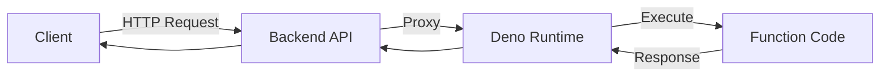

## Overview

InsForge Functions provide serverless compute powered by Deno. Write custom backend logic in TypeScript/JavaScript without managing servers.

### Key Features

- **Deno Runtime** - Modern, secure JavaScript/TypeScript execution
- **Single Endpoint** - One function = one endpoint
- **All HTTP Methods** - GET, POST, PUT, PATCH, DELETE support
- **Request/Response API** - Standard Web API (Request/Response objects)
- **Instant Deployment** - Deploy via API or dashboard
- **Auto-scaling** - Scales automatically with demand

## Architecture



## Creating Functions

### Basic Function

<CodeGroup>
```typescript Function Code
// Export default async function
export default async function(request: Request): Promise<Response> {
  const { name = 'World' } = await request.json();
  
  return new Response(
    JSON.stringify({ message: `Hello, ${name}!` }),
    {
      headers: { 'Content-Type': 'application/json' },
      status: 200
    }
  );
}
```

```bash Create via API
curl -X POST https://your-app.region.insforge.app/api/functions \
  -H "Authorization: Bearer YOUR_ADMIN_TOKEN" \
  -H "Content-Type: application/json" \
  -d '{
    "name": "Hello World Function",
    "slug": "hello-world",
    "code": "export default async function(request) { return new Response(JSON.stringify({ message: 'Hello!' }), { headers: { '"'Content-Type'"': '"'application/json'"' } }); }",
    "description": "Returns a greeting message",
    "status": "active"
  }'
```
</CodeGroup>

### Function Signature

All functions must export a default async function:

```typescript
export default async function(
  request: Request
): Promise<Response> {
  // Your code here
  return new Response(...);
}
```

## Request Handling

### Reading Request Data

<CodeGroup>
```typescript JSON Body
export default async function(request: Request) {
  const data = await request.json();
  console.log('Received:', data);
  
  return new Response(
    JSON.stringify({ received: data }),
    { headers: { 'Content-Type': 'application/json' } }
  );
}
```

```typescript URL Parameters
export default async function(request: Request) {
  const url = new URL(request.url);
  const name = url.searchParams.get('name') || 'Guest';
  
  return new Response(
    JSON.stringify({ greeting: `Hello, ${name}!` }),
    { headers: { 'Content-Type': 'application/json' } }
  );
}
```

```typescript Headers
export default async function(request: Request) {
  const auth = request.headers.get('Authorization');
  const userAgent = request.headers.get('User-Agent');
  
  return new Response(
    JSON.stringify({ auth, userAgent }),
    { headers: { 'Content-Type': 'application/json' } }
  );
}
```

```typescript HTTP Method
export default async function(request: Request) {
  const method = request.method;
  
  if (method === 'POST') {
    const data = await request.json();
    // Handle POST
  } else if (method === 'GET') {
    // Handle GET
  }
  
  return new Response(
    JSON.stringify({ method }),
    { headers: { 'Content-Type': 'application/json' } }
  );
}
```
</CodeGroup>

### Returning Responses

<CodeGroup>
```typescript JSON Response
return new Response(
  JSON.stringify({ success: true, data: result }),
  {
    status: 200,
    headers: { 'Content-Type': 'application/json' }
  }
);
```

```typescript Plain Text
return new Response('Hello, World!', {
  status: 200,
  headers: { 'Content-Type': 'text/plain' }
});
```

```typescript HTML
return new Response('<h1>Hello, World!</h1>', {
  status: 200,
  headers: { 'Content-Type': 'text/html' }
});
```

```typescript Error Response
return new Response(
  JSON.stringify({ error: 'Not found' }),
  {
    status: 404,
    headers: { 'Content-Type': 'application/json' }
  }
);
```
</CodeGroup>

## Invoking Functions

### Via SDK

<CodeGroup>
```typescript TypeScript SDK
import { createClient } from '@insforge/sdk';

const client = createClient({
  baseUrl: 'https://your-app.region.insforge.app',
  anonKey: 'your-anon-key'
});

const { data, error } = await client.functions.invoke('hello-world', {
  body: { name: 'John' }
});

if (error) {
  console.error('Function error:', error);
} else {
  console.log('Result:', data);
}
```

```typescript With Custom Options
const { data, error } = await client.functions.invoke('process-data', {
  method: 'POST',
  headers: {
    'X-Custom-Header': 'value'
  },
  body: {
    items: [1, 2, 3]
  }
});
```
</CodeGroup>

### Direct HTTP Calls

<CodeGroup>
```bash GET Request
curl https://your-app.region.insforge.app/functions/hello-world
```

```bash POST with JSON
curl -X POST https://your-app.region.insforge.app/functions/process-data \
  -H "Content-Type: application/json" \
  -H "Authorization: Bearer YOUR_TOKEN" \
  -d '{"name": "John", "age": 30}'
```

```typescript Fetch API
const response = await fetch(
  'https://your-app.region.insforge.app/functions/hello-world',
  {
    method: 'POST',
    headers: {
      'Content-Type': 'application/json',
      'Authorization': `Bearer ${token}`
    },
    body: JSON.stringify({ name: 'John' })
  }
);

const data = await response.json();
```
</CodeGroup>

## Use Cases

### Webhook Handler

```typescript
export default async function(request: Request) {
  // Validate webhook signature
  const signature = request.headers.get('X-Webhook-Signature');
  
  // Parse webhook payload
  const payload = await request.json();
  
  // Process event
  if (payload.event === 'order.created') {
    // Send confirmation email
    // Update analytics
    // Notify admin
  }
  
  return new Response(
    JSON.stringify({ received: true }),
    { status: 200, headers: { 'Content-Type': 'application/json' } }
  );
}
```

### Data Processing

```typescript
export default async function(request: Request) {
  const { items } = await request.json();
  
  // Process data
  const processed = items.map((item: any) => ({
    ...item,
    processed: true,
    timestamp: new Date().toISOString()
  }));
  
  // Could also save to database here
  // await client.database.from('processed_items').insert(processed);
  
  return new Response(
    JSON.stringify({ processed }),
    { headers: { 'Content-Type': 'application/json' } }
  );
}
```

### API Proxy

```typescript
export default async function(request: Request) {
  const url = new URL(request.url);
  const endpoint = url.searchParams.get('endpoint');
  
  // Call external API
  const response = await fetch(`https://api.example.com/${endpoint}`, {
    headers: {
      'Authorization': `Bearer ${Deno.env.get('EXTERNAL_API_KEY')}`
    }
  });
  
  const data = await response.json();
  
  return new Response(
    JSON.stringify(data),
    { headers: { 'Content-Type': 'application/json' } }
  );
}
```

### Email Sender

```typescript
export default async function(request: Request) {
  const { to, subject, html } = await request.json();
  
  // Send email via external service
  const response = await fetch('https://api.sendgrid.com/v3/mail/send', {
    method: 'POST',
    headers: {
      'Authorization': `Bearer ${Deno.env.get('SENDGRID_API_KEY')}`,
      'Content-Type': 'application/json'
    },
    body: JSON.stringify({
      personalizations: [{ to: [{ email: to }] }],
      from: { email: 'noreply@yourapp.com' },
      subject,
      content: [{ type: 'text/html', value: html }]
    })
  });
  
  return new Response(
    JSON.stringify({ sent: response.ok }),
    { status: response.ok ? 200 : 500,
      headers: { 'Content-Type': 'application/json' }
    }
  );
}
```

## Function Management

### List Functions

```bash
curl https://your-app.region.insforge.app/api/functions \
  -H "Authorization: Bearer YOUR_ADMIN_TOKEN"
```

Response:
```json
[
  {
    "id": "123e4567-e89b-12d3-a456-426614174000",
    "slug": "hello-world",
    "name": "Hello World Function",
    "description": "Returns a greeting message",
    "status": "active",
    "created_at": "2024-01-21T10:30:00Z",
    "updated_at": "2024-01-21T10:35:00Z",
    "deployed_at": "2024-01-21T10:35:00Z"
  }
]
```

### Get Function Details

```bash
curl https://your-app.region.insforge.app/api/functions/hello-world \
  -H "Authorization: Bearer YOUR_ADMIN_TOKEN"
```

### Update Function

```bash
curl -X PUT https://your-app.region.insforge.app/api/functions/hello-world \
  -H "Authorization: Bearer YOUR_ADMIN_TOKEN" \
  -H "Content-Type: application/json" \
  -d '{
    "code": "export default async function(request) { ... }",
    "status": "active"
  }'
```

### Delete Function

```bash
curl -X DELETE https://your-app.region.insforge.app/api/functions/hello-world \
  -H "Authorization: Bearer YOUR_ADMIN_TOKEN"
```

## Function Status

| Status | Description |
|--------|-------------|
| `draft` | Not deployed, not callable |
| `active` | Deployed and callable |
| `error` | Deployment failed |

## Deno Runtime

### Available APIs

Deno provides modern web standards:

- **Fetch API** - HTTP requests
- **URL API** - URL parsing
- **FormData** - Form data handling
- **ReadableStream** - Streaming
- **Crypto API** - Cryptography
- **Web Storage API** - localStorage/sessionStorage

### Environment Variables

```typescript
const apiKey = Deno.env.get('EXTERNAL_API_KEY');
const dbUrl = Deno.env.get('DATABASE_URL');
```

<Info>
Contact support to set environment variables for your functions.
</Info>

### Security

Dangerous operations are blocked:

- `Deno.run()` - Process execution
- `Deno.spawn()` - Process spawning
- File system access (restricted)

## Limitations

<Warning>
**Important Constraints**

- **No Subpaths** - One function = one endpoint (no `/function/path/subpath`)
- **No WebSockets** - Use Real-time API for WebSocket connections
- **Execution Time** - Functions timeout after 30 seconds
- **Memory** - Limited to 512MB per execution
</Warning>

## Error Handling

<CodeGroup>
```typescript Try-Catch
export default async function(request: Request) {
  try {
    const data = await request.json();
    const result = await processData(data);
    
    return new Response(
      JSON.stringify({ success: true, result }),
      { headers: { 'Content-Type': 'application/json' } }
    );
  } catch (error) {
    return new Response(
      JSON.stringify({ 
        error: error.message,
        stack: error.stack 
      }),
      { 
        status: 500,
        headers: { 'Content-Type': 'application/json' }
      }
    );
  }
}
```

```typescript Validation
export default async function(request: Request) {
  const data = await request.json();
  
  if (!data.email) {
    return new Response(
      JSON.stringify({ error: 'Email is required' }),
      { status: 400, headers: { 'Content-Type': 'application/json' } }
    );
  }
  
  // Process...
}
```
</CodeGroup>

## API Reference

### Management Endpoints (Admin)

```
GET    /api/functions              # List all functions
POST   /api/functions              # Create function
GET    /api/functions/{slug}       # Get function details
PUT    /api/functions/{slug}       # Update function
DELETE /api/functions/{slug}       # Delete function
```

### Execution Endpoint (Client)

```
* /functions/{slug}  # Execute function (all HTTP methods)
```

### Function Metadata

```typescript
interface FunctionMetadata {
  id: string;
  slug: string;
  name: string;
  description?: string;
  status: 'draft' | 'active' | 'error';
  created_at: string;
  updated_at: string;
  deployed_at?: string;
}

interface FunctionDetails extends FunctionMetadata {
  code: string;
}
```

## Best Practices

<Card title="Keep Functions Small" icon="cube">
  Each function should do one thing well
</Card>

<Card title="Use Environment Variables" icon="key">
  Store API keys and secrets in environment variables, not code
</Card>

<Card title="Return Proper Status Codes" icon="signal">
  Use HTTP status codes correctly (200, 400, 404, 500, etc.)
</Card>

<Card title="Handle Errors Gracefully" icon="shield">
  Always catch and return meaningful error messages
</Card>

<Card title="Validate Input" icon="check">
  Check request data before processing
</Card>

## Next Steps

<CardGroup cols={2}>
  <Card title="Database" icon="database" href="/features/database">
    Query database from functions
  </Card>
  <Card title="Storage" icon="folder" href="/features/storage">
    Process uploaded files
  </Card>
  <Card title="AI Integration" icon="brain" href="/features/ai-integration">
    Add AI capabilities to functions
  </Card>
  <Card title="Real-time" icon="radio" href="/features/realtime">
    Trigger real-time events
  </Card>
</CardGroup>
