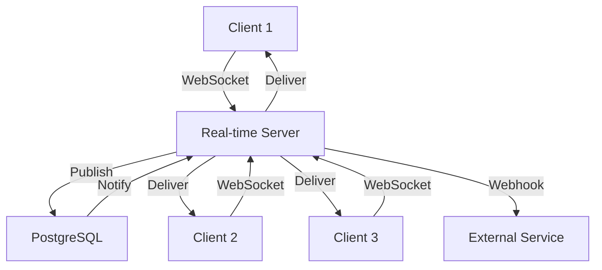

## Overview

InsForge Real-time provides WebSocket-based pub/sub messaging for live updates, chat, notifications, and collaborative features.

### Key Features

- **Channel-based Messaging** - Organize messages with pattern matching
- **WebSocket Pub/Sub** - Low-latency bidirectional communication
- **Webhook Integration** - Forward messages to external services
- **Message History** - Query past messages via API
- **Row Level Security** - Database-level access control
- **Delivery Tracking** - Monitor message delivery rates

## Architecture



## Channels

Channels use pattern matching to organize subscriptions.

### Creating Channels

<CodeGroup>
```bash cURL
curl -X POST https://your-app.region.insforge.app/api/realtime/channels \
  -H "Authorization: Bearer YOUR_TOKEN" \
  -H "Content-Type: application/json" \
  -d '{
    "pattern": "chat:*",
    "description": "Chat room messages",
    "webhookUrls": ["https://example.com/webhook"],
    "enabled": true
  }'
```

```typescript MCP Tool
// Use InsForge MCP create-realtime-channel tool
// This is recommended for infrastructure setup
```
</CodeGroup>

Response:
```json
{
  "id": "550e8400-e29b-41d4-a716-446655440000",
  "pattern": "chat:*",
  "description": "Chat room messages",
  "webhookUrls": ["https://example.com/webhook"],
  "enabled": true,
  "createdAt": "2024-01-15T10:30:00Z",
  "updatedAt": "2024-01-15T10:30:00Z"
}
```

### Channel Patterns

Patterns support wildcard matching:

| Pattern | Matches | Use Case |
|---------|---------|----------|
| `chat:*` | `chat:room1`, `chat:room2` | Multiple chat rooms |
| `order:*` | `order:123`, `order:456` | Order-specific updates |
| `user:*:notifications` | `user:123:notifications` | User notifications |
| `global` | `global` | Broadcast to all |

### List Channels

```bash
curl https://your-app.region.insforge.app/api/realtime/channels \
  -H "Authorization: Bearer YOUR_TOKEN"
```

## WebSocket Connection

### Connecting

<CodeGroup>
```typescript TypeScript SDK
import { createClient } from '@insforge/sdk';

const client = createClient({
  baseUrl: 'https://your-app.region.insforge.app',
  anonKey: 'your-anon-key'
});

// Connect with authentication
await client.realtime.connect({
  accessToken: 'your-access-token'
});

console.log('Connected to real-time server');
```

```typescript Native WebSocket
const ws = new WebSocket(
  'wss://your-app.region.insforge.app/api/realtime/ws'
);

ws.onopen = () => {
  // Authenticate
  ws.send(JSON.stringify({
    type: 'auth',
    token: 'your-access-token'
  }));
};

ws.onmessage = (event) => {
  const message = JSON.parse(event.data);
  console.log('Received:', message);
};
```
</CodeGroup>

### Connection States

<CodeGroup>
```typescript Listen to State Changes
client.realtime.on('connect', () => {
  console.log('Connected');
});

client.realtime.on('disconnect', () => {
  console.log('Disconnected');
});

client.realtime.on('error', (error) => {
  console.error('Error:', error);
});
```

```typescript Check State
if (client.realtime.isConnected()) {
  console.log('Connection active');
}
```
</CodeGroup>

## Subscribing to Channels

<CodeGroup>
```typescript Subscribe to Channel
const subscription = client.realtime
  .channel('chat:room1')
  .on('message', (payload) => {
    console.log('Message:', payload);
  })
  .subscribe();
```

```typescript Multiple Event Types
const subscription = client.realtime
  .channel('chat:room1')
  .on('message.new', (payload) => {
    console.log('New message:', payload);
  })
  .on('message.edit', (payload) => {
    console.log('Edited message:', payload);
  })
  .on('message.delete', (payload) => {
    console.log('Deleted message:', payload);
  })
  .subscribe();
```

```typescript React Example
import { useEffect, useState } from 'react';

function ChatRoom({ roomId }: { roomId: string }) {
  const [messages, setMessages] = useState<any[]>([]);
  
  useEffect(() => {
    const subscription = client.realtime
      .channel(`chat:${roomId}`)
      .on('message', (payload) => {
        setMessages(prev => [...prev, payload]);
      })
      .subscribe();
    
    return () => {
      subscription.unsubscribe();
    };
  }, [roomId]);
  
  return (
    <div>
      {messages.map((msg, i) => (
        <div key={i}>{msg.text}</div>
      ))}
    </div>
  );
}
```
</CodeGroup>

### Unsubscribing

<CodeGroup>
```typescript Unsubscribe from Channel
subscription.unsubscribe();
```

```typescript Remove Specific Listener
const handler = (payload) => console.log(payload);

subscription.on('message', handler);

// Later
subscription.off('message', handler);
```

```typescript Unsubscribe All
client.realtime.removeAllChannels();
```
</CodeGroup>

## Publishing Messages

<CodeGroup>
```typescript TypeScript SDK
// Publish to channel
const { error } = await client.realtime
  .channel('chat:room1')
  .send({
    type: 'message',
    event: 'message.new',
    payload: {
      text: 'Hello, world!',
      userId: '123',
      timestamp: Date.now()
    }
  });

if (error) {
  console.error('Failed to send:', error);
}
```

```typescript With Event Name
await client.realtime
  .channel('order:456')
  .send({
    type: 'broadcast',
    event: 'order.status_changed',
    payload: {
      orderId: '456',
      status: 'shipped',
      trackingNumber: 'TRACK123'
    }
  });
```

```typescript Native WebSocket
ws.send(JSON.stringify({
  type: 'publish',
  channel: 'chat:room1',
  event: 'message.new',
  payload: {
    text: 'Hello!',
    userId: '123'
  }
}));
```
</CodeGroup>

## Message Structure

```typescript
interface RealtimeMessage {
  type: 'message' | 'broadcast';
  event: string;           // e.g., "message.new"
  channel: string;         // e.g., "chat:room1"
  payload: any;           // Your custom data
  senderId?: string;      // User ID of sender
  timestamp: string;      // ISO 8601
}
```

## Presence

Track who's online in a channel:

<CodeGroup>
```typescript Track Presence
const channel = client.realtime.channel('chat:room1');

// Set initial presence
await channel.track({
  user_id: '123',
  username: 'John',
  status: 'online'
});

// Listen to presence changes
channel.on('presence', (event) => {
  if (event.type === 'join') {
    console.log('User joined:', event.presence);
  } else if (event.type === 'leave') {
    console.log('User left:', event.presence);
  }
});
```

```typescript Get Current Presence
const presences = channel.presenceState();
console.log('Users online:', Object.keys(presences).length);
```

```typescript React Presence
function OnlineUsers({ roomId }: { roomId: string }) {
  const [users, setUsers] = useState<any[]>([]);
  
  useEffect(() => {
    const channel = client.realtime.channel(`chat:${roomId}`);
    
    channel.on('presence', (event) => {
      setUsers(Object.values(channel.presenceState()));
    });
    
    channel.track({ user_id: currentUserId });
    channel.subscribe();
    
    return () => channel.unsubscribe();
  }, [roomId]);
  
  return (
    <div>
      Online: {users.length}
      {users.map(user => <div key={user.user_id}>{user.username}</div>)}
    </div>
  );
}
```
</CodeGroup>

## Webhooks

Forward messages to external services:

### Webhook Payload

```json
{
  "event": "message.new",
  "channelName": "chat:room1",
  "channelId": "550e8400-e29b-41d4-a716-446655440000",
  "payload": {
    "text": "Hello, world!",
    "userId": "123"
  },
  "senderId": "123e4567-e89b-12d3-a456-426614174000",
  "timestamp": "2024-01-15T10:30:00Z"
}
```

### Webhook Endpoint

<CodeGroup>
```typescript Express Handler
app.post('/webhook', express.json(), (req, res) => {
  const { event, channelName, payload } = req.body;
  
  console.log(`Received ${event} on ${channelName}:`, payload);
  
  // Process message
  if (event === 'message.new') {
    // Send notification, log to analytics, etc.
  }
  
  res.status(200).json({ received: true });
});
```

```typescript Verify Signature
// Optional: Verify webhook signature
import crypto from 'crypto';

function verifyWebhook(req: Request): boolean {
  const signature = req.headers['x-insforge-signature'];
  const payload = JSON.stringify(req.body);
  
  const hash = crypto
    .createHmac('sha256', WEBHOOK_SECRET)
    .update(payload)
    .digest('hex');
  
  return signature === hash;
}
```
</CodeGroup>

## Message History

### Query Messages

<CodeGroup>
```bash cURL
curl "https://your-app.region.insforge.app/api/realtime/messages?channelId=550e8400&limit=50" \
  -H "Authorization: Bearer YOUR_TOKEN"
```

```typescript TypeScript SDK
const { data, error } = await client.realtime.getMessages({
  channelId: '550e8400-e29b-41d4-a716-446655440000',
  limit: 50,
  offset: 0
});

if (!error) {
  data.forEach(msg => {
    console.log(`${msg.eventName}:`, msg.payload);
  });
}
```

```typescript Filter by Event
const { data } = await client.realtime.getMessages({
  channelId: channelId,
  eventName: 'message.new'
});
```
</CodeGroup>

Response:
```json
[
  {
    "id": "660e8400-e29b-41d4-a716-446655440000",
    "eventName": "message.new",
    "channelId": "550e8400-e29b-41d4-a716-446655440000",
    "channelName": "chat:room1",
    "payload": {
      "text": "Hello!",
      "userId": "123"
    },
    "senderType": "user",
    "senderId": "770e8400-e29b-41d4-a716-446655440000",
    "wsAudienceCount": 5,
    "whAudienceCount": 1,
    "whDeliveredCount": 1,
    "createdAt": "2024-01-15T10:30:00Z"
  }
]
```

### Message Statistics

```bash
curl "https://your-app.region.insforge.app/api/realtime/messages/stats?channelId=550e8400" \
  -H "Authorization: Bearer YOUR_TOKEN"
```

Response:
```json
{
  "totalMessages": 1250,
  "whDeliveryRate": 0.98,
  "topEvents": [
    { "eventName": "message.new", "count": 450 },
    { "eventName": "message.edit", "count": 120 }
  ]
}
```

## Row Level Security

Control access with RLS policies:

### Subscribe Permissions

```sql
-- Users can only subscribe to channels they have access to
CREATE POLICY "Users can subscribe to public channels"
ON realtime_channels FOR SELECT
USING (enabled = true AND is_public = true);

CREATE POLICY "Users can subscribe to their own channels"
ON realtime_channels FOR SELECT
USING (owner_id = auth.user_id());
```

### Publish Permissions

```sql
-- Users can only publish to channels they're members of
CREATE POLICY "Users can publish to their channels"
ON realtime_messages FOR INSERT
WITH CHECK (
  EXISTS (
    SELECT 1 FROM channel_members
    WHERE channel_id = realtime_messages.channel_id
    AND user_id = auth.user_id()
  )
);
```

### Get RLS Policies

```bash
curl https://your-app.region.insforge.app/api/realtime/permissions \
  -H "Authorization: Bearer YOUR_TOKEN"
```

## Use Cases

### Chat Application

<Steps>
  <Step title="Create Chat Channel">
    ```typescript
    await createChannel({
      pattern: 'chat:*',
      description: 'Chat rooms'
    });
    ```
  </Step>
  
  <Step title="Subscribe to Room">
    ```typescript
    const sub = client.realtime
      .channel(`chat:${roomId}`)
      .on('message', handleMessage)
      .subscribe();
    ```
  </Step>
  
  <Step title="Send Messages">
    ```typescript
    await client.realtime
      .channel(`chat:${roomId}`)
      .send({
        type: 'message',
        event: 'message.new',
        payload: { text, userId }
      });
    ```
  </Step>
</Steps>

### Live Notifications

```typescript
// Subscribe to user notifications
client.realtime
  .channel(`user:${userId}:notifications`)
  .on('notification', (payload) => {
    showNotification(payload);
  })
  .subscribe();

// Send notification
await client.realtime
  .channel(`user:${userId}:notifications`)
  .send({
    type: 'broadcast',
    event: 'notification',
    payload: {
      title: 'New message',
      body: 'You have a new message',
      type: 'info'
    }
  });
```

### Live Cursors

```typescript
// Track cursor position
const channel = client.realtime.channel('document:123');

document.addEventListener('mousemove', (e) => {
  channel.track({
    user_id: userId,
    cursor: { x: e.clientX, y: e.clientY }
  });
});

// Render other users' cursors
channel.on('presence', () => {
  const users = channel.presenceState();
  renderCursors(users);
});
```

## Best Practices

<Card title="Use Channel Patterns" icon="layer-group">
  Organize channels with patterns like `resource:id` for scalability
</Card>

<Card title="Implement Reconnection" icon="rotate">
  Handle disconnections and reconnect automatically
</Card>

<Card title="Debounce Presence Updates" icon="clock">
  Don't send presence updates too frequently (max 1/sec)
</Card>

<Card title="Clean Up Subscriptions" icon="broom">
  Always unsubscribe when components unmount
</Card>

<Card title="Use RLS for Security" icon="shield">
  Protect channels with Row Level Security policies
</Card>

## Next Steps

<CardGroup cols={2}>
  <Card title="Database" icon="database" href="/features/database">
    Store message history and user data
  </Card>
  <Card title="Authentication" icon="lock" href="/features/authentication">
    Secure WebSocket connections
  </Card>
  <Card title="Functions" icon="code" href="/features/functions">
    Process messages server-side
  </Card>
  <Card title="AI Integration" icon="brain" href="/features/ai-integration">
    Build AI-powered chat
  </Card>
</CardGroup>
