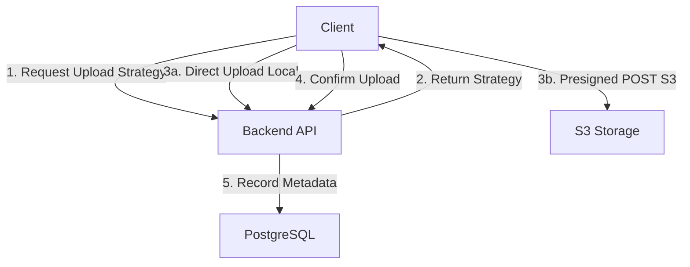

## Overview

InsForge provides S3-compatible object storage for managing files. Files are organized in buckets with public or private access control.

### Key Features

- **S3-Compatible** - Works with any S3-compatible storage backend
- **Buckets** - Organize files into logical containers
- **Public/Private Access** - Control file visibility
- **Presigned URLs** - Secure temporary access to private files
- **Direct Upload** - Upload large files directly to S3
- **Auto-generated Keys** - Unique filenames to prevent collisions

## Architecture



## Bucket Management

### Creating Buckets

Buckets must be created before uploading files.

<CodeGroup>
```typescript MCP Tool (Recommended)
// Use the InsForge MCP create-bucket tool
// This is the recommended way for infrastructure setup
```

```bash cURL
curl -X POST https://your-app.region.insforge.app/api/storage/buckets \
  -H "Authorization: Bearer YOUR_ADMIN_TOKEN" \
  -H "Content-Type: application/json" \
  -d '{
    "bucketName": "avatars",
    "isPublic": true
  }'
```
</CodeGroup>

Response:
```json
{
  "message": "Bucket created successfully",
  "bucketName": "avatars"
}
```

### Bucket Visibility

| Type | Access | Use Case |
|------|--------|----------|
| **Public** | Direct URLs, no auth | Profile pictures, public assets |
| **Private** | Presigned URLs with expiration | User documents, sensitive files |

### List Buckets

```bash
curl https://your-app.region.insforge.app/api/storage/buckets \
  -H "Authorization: Bearer YOUR_ADMIN_TOKEN"
```

Response:
```json
{
  "buckets": [
    "avatars",
    "documents",
    "uploads"
  ]
}
```

### Update Bucket Visibility

```bash
curl -X PATCH https://your-app.region.insforge.app/api/storage/buckets/avatars \
  -H "Authorization: Bearer YOUR_ADMIN_TOKEN" \
  -H "Content-Type: application/json" \
  -d '{"isPublic": false}'
```

### Delete Bucket

<Warning>
Deletes all files in the bucket permanently.
</Warning>

```bash
curl -X DELETE https://your-app.region.insforge.app/api/storage/buckets/avatars \
  -H "Authorization: Bearer YOUR_ADMIN_TOKEN"
```

## Uploading Files

InsForge provides two upload strategies:

1. **Direct Upload** - For local storage, upload directly to backend
2. **Presigned URL** - For S3, upload directly to storage provider

### Simple Upload (SDK)

<CodeGroup>
```typescript TypeScript SDK
import { createClient } from '@insforge/sdk';

const client = createClient({
  baseUrl: 'https://your-app.region.insforge.app',
  anonKey: 'your-anon-key'
});

// Upload file to bucket
const { data, error } = await client.storage
  .from('avatars')
  .upload(file);

if (error) {
  console.error('Upload failed:', error);
} else {
  console.log('File uploaded:', data);
  console.log('URL:', data.url);
}
```

```typescript With Custom Key
// Upload with specific filename
const { data, error } = await client.storage
  .from('avatars')
  .upload(file, {
    key: 'profile/user-123.jpg'
  });
```

```typescript React Example
import { useState } from 'react';

function FileUpload() {
  const [uploading, setUploading] = useState(false);
  
  const handleUpload = async (e: React.ChangeEvent<HTMLInputElement>) => {
    const file = e.target.files?.[0];
    if (!file) return;
    
    setUploading(true);
    const { data, error } = await client.storage
      .from('avatars')
      .upload(file);
    
    setUploading(false);
    
    if (error) {
      alert('Upload failed: ' + error.message);
    } else {
      console.log('Uploaded to:', data.url);
    }
  };
  
  return (
    <input 
      type="file" 
      onChange={handleUpload}
      disabled={uploading}
    />
  );
}
```
</CodeGroup>

### Advanced Upload (Presigned URLs)

For large files, get upload strategy first:

<Steps>
  <Step title="Get Upload Strategy">
    ```typescript
    const { data: strategy } = await client.storage
      .from('avatars')
      .getUploadStrategy({
        filename: file.name,
        contentType: file.type,
        size: file.size
      });
    
    console.log('Method:', strategy.method); // 'presigned' or 'direct'
    console.log('Upload URL:', strategy.uploadUrl);
    ```
  </Step>
  
  <Step title="Upload to Storage">
    For S3 presigned POST:
    ```typescript
    if (strategy.method === 'presigned') {
      const formData = new FormData();
      
      // Add presigned fields
      Object.entries(strategy.fields).forEach(([key, value]) => {
        formData.append(key, value);
      });
      
      // Add file last
      formData.append('file', file);
      
      // Upload to S3
      await fetch(strategy.uploadUrl, {
        method: 'POST',
        body: formData
      });
    }
    ```
  </Step>
  
  <Step title="Confirm Upload">
    ```typescript
    if (strategy.confirmRequired) {
      const { data, error } = await fetch(strategy.confirmUrl, {
        method: 'POST',
        headers: {
          'Content-Type': 'application/json',
          'Authorization': `Bearer ${accessToken}`
        },
        body: JSON.stringify({
          size: file.size,
          contentType: file.type
        })
      });
    }
    ```
  </Step>
</Steps>

## Downloading Files

### Public Files

Public files can be accessed directly:

```typescript
const publicUrl = `${baseUrl}/api/storage/buckets/avatars/objects/user-123.jpg`;

// Use in img tag

```

### Private Files

Get temporary signed URL for private files:

<CodeGroup>
```typescript TypeScript SDK
const { data, error } = await client.storage
  .from('documents')
  .download('invoice-2024.pdf');

if (!error) {
  console.log('Download URL:', data.url);
  console.log('Expires at:', data.expiresAt);
}
```

```typescript Custom Expiration
const { data } = await client.storage
  .from('documents')
  .getDownloadStrategy('invoice.pdf', {
    expiresIn: 3600 // 1 hour
  });
```

```typescript React Example
function DownloadButton({ fileKey }: { fileKey: string }) {
  const handleDownload = async () => {
    const { data, error } = await client.storage
      .from('documents')
      .download(fileKey);
    
    if (!error) {
      window.open(data.url, '_blank');
    }
  };
  
  return <button onClick={handleDownload}>Download</button>;
}
```
</CodeGroup>

### Download Strategy Response

```typescript
interface DownloadStrategy {
  method: 'direct' | 'presigned';
  url: string;
  expiresAt?: string; // For presigned URLs
  headers?: Record<string, string>;
}
```

## Listing Files

### List All Files in Bucket

<CodeGroup>
```typescript TypeScript SDK
const { data, error } = await client.storage
  .from('avatars')
  .list();

if (!error) {
  data.forEach(file => {
    console.log('File:', file.key);
    console.log('Size:', file.size);
    console.log('URL:', file.url);
  });
}
```

```bash cURL
curl "https://your-app.region.insforge.app/api/storage/buckets/avatars/objects" \
  -H "Authorization: Bearer YOUR_TOKEN"
```
</CodeGroup>

Response:
```json
{
  "data": [
    {
      "bucket": "avatars",
      "key": "user-123.jpg",
      "size": 102400,
      "mimeType": "image/jpeg",
      "uploadedAt": "2024-01-15T10:30:00Z",
      "url": "/api/storage/buckets/avatars/objects/user-123.jpg"
    }
  ],
  "pagination": {
    "offset": 0,
    "limit": 100,
    "total": 1
  }
}
```

### Filtering and Pagination

<CodeGroup>
```typescript Prefix Filter
// List files in specific folder
const { data } = await client.storage
  .from('documents')
  .list({
    prefix: 'invoices/'
  });
```

```typescript Search
const { data } = await client.storage
  .from('avatars')
  .list({
    search: 'profile'
  });
```

```typescript Pagination
const { data } = await client.storage
  .from('documents')
  .list({
    limit: 50,
    offset: 100
  });
```
</CodeGroup>

## Deleting Files

<CodeGroup>
```typescript TypeScript SDK
const { error } = await client.storage
  .from('avatars')
  .remove('user-123.jpg');

if (!error) {
  console.log('File deleted');
}
```

```bash cURL
curl -X DELETE https://your-app.region.insforge.app/api/storage/buckets/avatars/objects/user-123.jpg \
  -H "Authorization: Bearer YOUR_TOKEN"
```
</CodeGroup>

## File Organization

### Using Pseudo-folders

Organize files with forward slashes in keys:

```typescript
// Upload to pseudo-folder
await client.storage
  .from('documents')
  .upload(file, {
    key: 'users/123/invoices/2024-01.pdf'
  });

// List files in folder
const { data } = await client.storage
  .from('documents')
  .list({ prefix: 'users/123/invoices/' });
```

### Naming Conventions

```typescript
// Auto-generated key format:
// {filename}-{timestamp}-{random}.{ext}
// Example: profile-1737546841234-a3f2b1.jpg

// Custom key patterns:
const key = `users/${userId}/avatar-${Date.now()}.jpg`;
const key = `documents/${year}/${month}/${filename}`;
```

## Integration with Database

Store file URLs in database after upload:

<CodeGroup>
```typescript Upload & Save URL
// 1. Upload file
const { data: file, error: uploadError } = await client.storage
  .from('avatars')
  .upload(avatarFile);

if (uploadError) throw uploadError;

// 2. Save URL to database
const { error: dbError } = await client.database
  .from('profiles')
  .update({
    avatar_url: file.url
  })
  .eq('user_id', userId);

if (dbError) throw dbError;
```

```typescript Complete Example
async function updateUserAvatar(userId: string, file: File) {
  try {
    // Upload file
    const { data, error } = await client.storage
      .from('avatars')
      .upload(file, {
        key: `users/${userId}/avatar.jpg`
      });
    
    if (error) throw error;
    
    // Update profile with new URL
    await client.auth.updateProfile({
      avatar_url: data.url
    });
    
    return data.url;
  } catch (error) {
    console.error('Failed to update avatar:', error);
    throw error;
  }
}
```
</CodeGroup>

## File Types

Common MIME types:

| Type | MIME Type | Extension |
|------|-----------|----------|
| JPEG | image/jpeg | .jpg, .jpeg |
| PNG | image/png | .png |
| GIF | image/gif | .gif |
| WebP | image/webp | .webp |
| PDF | application/pdf | .pdf |
| JSON | application/json | .json |
| CSV | text/csv | .csv |
| ZIP | application/zip | .zip |

## Storage Quotas

<Info>
Contact InsForge support for storage quota limits and pricing.
</Info>

## API Reference

### Endpoints

```
# Bucket management (Admin)
GET    /api/storage/buckets
POST   /api/storage/buckets
DELETE /api/storage/buckets/{bucketName}
PATCH  /api/storage/buckets/{bucketName}

# File operations
GET    /api/storage/buckets/{bucket}/objects
POST   /api/storage/buckets/{bucket}/objects
PUT    /api/storage/buckets/{bucket}/objects/{key}
GET    /api/storage/buckets/{bucket}/objects/{key}
DELETE /api/storage/buckets/{bucket}/objects/{key}

# Upload/Download strategies
POST   /api/storage/buckets/{bucket}/upload-strategy
POST   /api/storage/buckets/{bucket}/objects/{key}/download-strategy
POST   /api/storage/buckets/{bucket}/objects/{key}/confirm-upload
```

### File Metadata

```typescript
interface StoredFile {
  bucket: string;
  key: string;
  size: number;
  mimeType: string;
  uploadedAt: string;
  url: string;
}
```

## Best Practices

<Card title="Use Public Buckets for Assets" icon="globe">
  Store profile pictures and public assets in public buckets for faster access
</Card>

<Card title="Prefix Keys with User ID" icon="folder-tree">
  Organize user files: `users/{userId}/documents/file.pdf`
</Card>

<Card title="Store URLs in Database" icon="database">
  Save file URLs in your database for easy querying and relationships
</Card>

<Card title="Set Appropriate Expiration" icon="clock">
  Use short expiration times (1 hour) for sensitive presigned URLs
</Card>

<Card title="Validate File Types" icon="file-shield">
  Check MIME types on client and server to prevent malicious uploads
</Card>

## Next Steps

<CardGroup cols={2}>
  <Card title="Database" icon="database" href="/features/database">
    Store file metadata and URLs
  </Card>
  <Card title="Authentication" icon="lock" href="/features/authentication">
    Secure file uploads with auth
  </Card>
  <Card title="Functions" icon="code" href="/features/functions">
    Process uploaded files
  </Card>
  <Card title="AI Integration" icon="brain" href="/features/ai-integration">
    Generate images with AI
  </Card>
</CardGroup>
