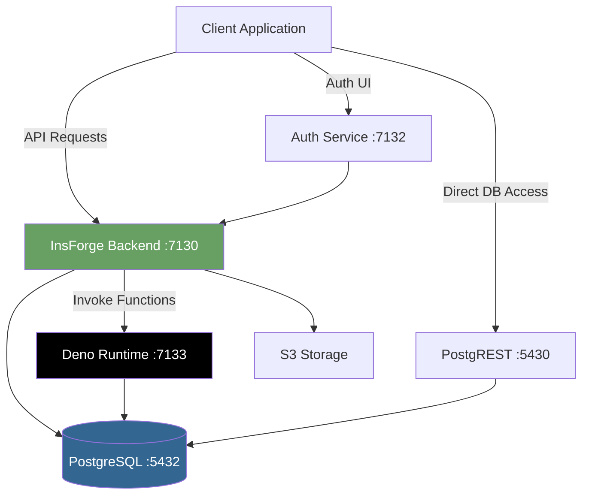

## Overview

InsForge is built as a modern, containerized backend-as-a-service platform designed for AI coding agents and developers. The architecture follows a microservices approach with clearly separated concerns.

## Core Components

The platform consists of five main services orchestrated via Docker Compose:

### 1. PostgreSQL Database

**Container:** `insforge-postgres`  
**Image:** `ghcr.io/insforge/postgres:v15.13.2`  
**Port:** `5432`

Custom PostgreSQL 15 image with:
- **pgcrypto extension** for encryption operations
- **Custom configuration** via `postgresql.conf`
- **JWT extension** for token generation
- **RLS (Row Level Security)** policies automatically created
- **Three role system:** `anon`, `authenticated`, `project_admin`

Database encryption uses `app.encryption_key` parameter for sensitive data.

### 2. PostgREST API Layer

**Container:** `insforge-postgrest`  
**Image:** `postgrest/postgrest:v12.2.12`  
**Port:** `5430` (internal: 3000)

Provides automatic RESTful API for PostgreSQL:
- Exposes `public` schema as REST endpoints
- JWT-based authentication
- Role-based access control via RLS
- Schema reloading via NOTIFY channel
- OpenAPI documentation generation

### 3. InsForge Backend

**Container:** `insforge`  
**Ports:**
- `7130` - Backend API server
- `7131` - Frontend dashboard
- `7132` - Auth service

**Monorepo Structure:**
```
insforge/
├── backend/        # Express.js API server
├── frontend/       # React dashboard (Vite)
├── auth/           # Authentication UI (Vite)
├── shared-schemas/ # Shared TypeScript types
├── ui/             # Shared UI components
└── functions/      # Serverless function templates
```

**Backend Responsibilities:**
- User authentication & session management
- Storage operations (S3-compatible)
- AI model gateway (OpenAI-compatible)
- Serverless function deployment
- Admin operations
- Database migrations

**Technology Stack:**
- **Backend:** Node.js + Express + TypeScript
- **Frontend:** React + Vite + TailwindCSS
- **Validation:** Zod schemas
- **Database:** node-postgres (pg)

### 4. Deno Runtime

**Container:** `insforge-deno`  
**Image:** `denoland/deno:alpine-2.0.6`  
**Port:** `7133`

Serverless function execution environment:
- **Isolated execution** for user-deployed functions
- **Worker-based** with configurable timeouts (default: 60s)
- **Direct PostgreSQL access** via connection string
- **Encrypted secrets** decrypted at runtime
- **Hot reload** in development mode

### 5. Vector Log Aggregator

**Container:** `insforge-vector`  
**Image:** `timberio/vector:0.28.1-alpine`

Log collection and shipping:
- Collects logs from all containers
- Ships to CloudWatch (when configured)
- Falls back to file-based logging
- Exposes health endpoint on `:7135/health`

## Data Flow



## Authentication Flow

### JWT Token Generation

1. User authenticates via `/auth/login` or OAuth
2. `TokenManager` generates JWT with:
   - `sub`: User ID
   - `email`: User email
   - `role`: `authenticated` or `project_admin`
3. Token signed with `JWT_SECRET`
4. Client stores token and includes in `Authorization: Bearer <token>` header

### Request Authorization

**Middleware Chain:** `backend/src/api/middlewares/auth.ts`

```typescript
// Three authentication methods:
1. verifyUser()    // Accepts user/admin JWT tokens
2. verifyAdmin()   // Requires admin token
3. verifyApiKey()  // Accepts API keys (ik_*)
```

### Row Level Security

PostgreSQL enforces data access via RLS policies:

```sql
-- Auto-created for new tables with RLS enabled
CREATE POLICY "project_admin_policy" 
  ON table_name
  FOR ALL 
  TO project_admin 
  USING (true) 
  WITH CHECK (true);

-- User-defined policies for authenticated/anon roles
CREATE POLICY "user_policy"
  ON table_name
  FOR ALL
  TO authenticated
  USING (uid() = user_id);
```

## Storage Architecture

Flexible storage backend supporting:

**Cloud Storage:**
- AWS S3
- S3-compatible services (Wasabi, MinIO, etc.)
- CloudFront CDN for signed URLs

**Local Storage:**
- Docker volume: `storage-data` → `/insforge-storage`
- Used when S3 credentials not configured

**Bucket Management:**
- Public/private access control
- File size limits via `MAX_FILE_SIZE`
- Metadata tracking in `auth.storage_objects` table

## Networking

**Bridge Network:** `insforge-network`

All containers communicate via internal DNS:
- `postgres:5432`
- `postgrest:3000`
- `deno:7133`
- `insforge:7130/7131/7132`

**Exposed Ports:**
```yaml
5432  # PostgreSQL (dev only)
5430  # PostgREST API
7130  # Backend API
7131  # Frontend Dashboard
7132  # Auth Service
7133  # Deno Runtime
```

## Persistence

**Docker Volumes:**
```yaml
postgres-data          # Database files
node_modules           # Dependencies (per service)
deno_cache             # Deno module cache
shared-logs            # Application logs
storage-data           # File uploads
```

## Monitoring & Logs

**Log Aggregation:**
- Vector collects from `/insforge-logs` volume
- Structured JSON logging via Winston
- CloudWatch integration (optional)
- Docker container logs via stdout

**Health Checks:**
```bash
# PostgreSQL
CMD-SHELL pg_isready -U postgres

# Vector
CMD wget --spider http://localhost:7135/health
```

## Development vs Production

### Development (`docker-compose.yml`)

- Hot reload enabled (Vite HMR)
- Source code mounted as volumes
- Debug logging enabled
- `npm run dev` in watch mode

### Production (`docker-compose.prod.yml`)

- Pre-built production images
- No source code volumes
- Optimized builds
- `npm run start` production server

## Security Considerations

<Warning>
**Never expose PostgreSQL port (5432) to the internet in production.** Use PostgREST or backend API exclusively.
</Warning>

1. **Database Access:** Only via PostgREST (JWT-authenticated) or backend
2. **Secrets:** All sensitive env vars should use Docker secrets in production
3. **Network:** Use reverse proxy (nginx/Caddy) for TLS termination
4. **RLS Policies:** Always enable RLS on tables with user data
5. **API Keys:** Rotate regularly and store securely

## Scalability

**Horizontal Scaling:**
- Backend/Frontend: Multiple replicas behind load balancer
- PostgreSQL: Read replicas + connection pooling (PgBouncer)
- Storage: S3 auto-scales

**Vertical Scaling:**
- Increase container resources via `docker-compose.yml`
- PostgreSQL: Tune `shared_buffers`, `work_mem`
- Deno: Adjust `WORKER_TIMEOUT_MS`